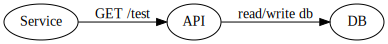

# Using Graphviz

This project shows how to use Graphviz in a Github project.

The process is as simple as:
* Generate a dot file with a diagram
* Export the diagram to an image
* Include the image in an Markdown file
```

or

```

## Examples

Example 1 (from dot/example.dot)

```
digraph example {
    rankdir=LR;
    Service -> API [label="GET /test"]
    API -> DB [label="read/write db"]
}
```

The output looks like:


Example 2 (from dot/example-2.dot)

```
digraph {
    rankdir=TD;

    subgraph cluster_0 {
        label="API Node";
        API;
        API -> DB;
    }

    subgraph cluster_1 {
        label="Node A";
        "service" -> API;
    }

    subgraph cluster_2 {
        label="Node B";
        "service 2" -> API;
    }

    subgraph cluster_3 {
        label="Node C";
        "service 3" -> API;
    }
}
```

The output looks like:


## Convert to image

Convert the dot file into an image by running:
`make svg` or `make png`. 

See Makefile for the commands used for these conversions.
